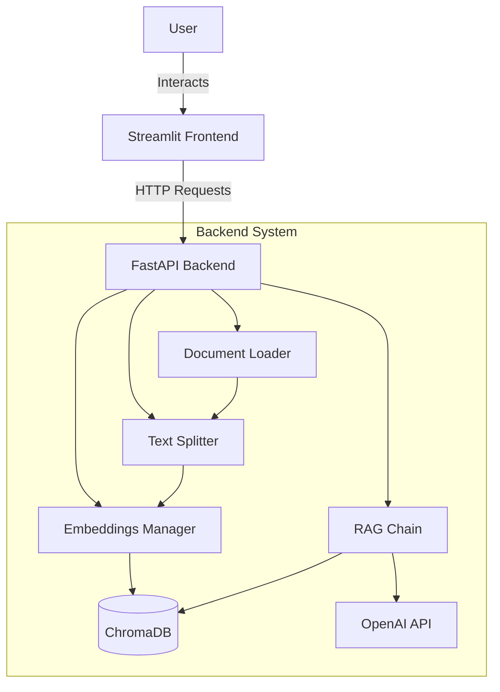

# 📄 Multi-language RAG Document Assistant

A production-ready RAG (Retrieval-Augmented Generation) assistant that allows users to query documents (PDF, TXT) in multiple languages with accurate source attribution.

## 🚀 Key Features

- **Multi-document Support**: specialized loaders for PDF and TXT files.
- **Intelligent Chunking**: Overlapping chunks to preserve context.
- **Multilingual Support**: Explicit prompts for English, Russian, Kazakh, French, German, Spanish, Chinese, and Japanese.
- **RAG Architecture**: Uses ChromaDB for vector storage and OpenAI for embeddings/generation.
- **Source Attribution**: Answers include citations and previews of the source text.
- **Modern UI**: Built with Streamlit, responsive for desktop and mobile.
- **API**: FastAPI backend for decoupled architecture.

## 🏗 System Architecture

The project follows a decoupled client-server architecture:



### Components

1.  **Frontend (`frontend/`)**: 
    -   Built with Streamlit.
    -   Handles file uploads and chat interface.
    -   Communicates with backend via REST API.

2.  **Backend (`app/`)**:
    -   **API (`main.py`)**: Exposes `/upload` and `/query` endpoints.
    -   **Document Loader (`rag/document_loader.py`)**: Parses files and extracts metadata.
    -   **Text Splitter (`rag/text_splitter.py`)**: Recursively splits text into semantic chunks.
    -   **Embeddings Manager (`rag/embeddings.py`)**: Handles OpenAI embeddings and ChromaDB persistence.
    -   **RAG Chain (`rag/chain.py`)**: Orchestrates the retrieval and generation process with language-specific rules.

## 🛠 Installation & Setup

### Prerequisites

- Python 3.9+
- OpenAI API Key

### Steps

1.  **Clone the repository**
    ```bash
    git clone <repository-url>
    cd Multi-language-RAG-Document-Assistant
    ```

2.  **Create and activate virtual environment**
    ```bash
    python -m venv venv
    source venv/bin/activate  # On Windows: venv\Scripts\activate
    ```

3.  **Install dependencies**
    ```bash
    pip install -r requirements.txt
    ```

4.  **Configure Environment**
    Create a `.env` file in the root directory:
    ```env
    OPENAI_API_KEY=sk-...
    MODEL_NAME=gpt-4o-mini
    TEMPERATURE=0
    ```

## 🏃‍♂️ Usage

### 1. Start the Backend API
Run the FastAPI server:
```bash
uvicorn app.main:app --reload --port 8000
```
Server will start at `http://127.0.0.1:8000`.

### 2. Start the Frontend Application
In a new terminal, run the Streamlit app:
```bash
streamlit run frontend/streamlit_app.py
```
The application will open in your browser (usually `http://localhost:8501`).

### 3. Using the App
1.  **Upload**: Use the sidebar to upload PDF or TXT documents.
2.  **Settings**: Choose your preferred answer language.
3.  **Ask**: Type your question in the chat box.

## 📡 API Reference

### `POST /upload`
Uploads and indexes a document.
-   **Body**: `multipart/form-data` with `file`.
-   **Response**: 
    ```json
    {
      "message": "Document processed successfully",
      "chunks": 15
    }
    ```

### `POST /query`
Asks a question against the indexed documents.
-   **Body**: JSON
    ```json
    {
      "question": "What is RAG?",
      "language": "English"
    }
    ```
-   **Response**:
    ```json
    {
      "answer": "RAG stands for...",
      "sources": [
        {
          "id": 1,
          "source": "doc.pdf",
          "preview": "..."
        }
      ]
    }
    ```

## ⚙️ Configuration

| Variable | Description | Default |
| :--- | :--- | :--- |
| `OPENAI_API_KEY` | Required. Your OpenAI API key. | - |
| `MODEL_NAME` | LLM model to use. | `gpt-4o-mini` |
| `TEMPERATURE` | Creativity of the model (0.0 - 1.0). | `0` |

## 📁 Directory Structure

```
├── app/
│   ├── main.py              # API Entry point
│   ├── models/              # Pydantic models
│   └── rag/                 # RAG Core logic
│       ├── loader.py        # File parsing
│       ├── splitter.py      # Chunking
│       ├── embeddings.py    # Vector DB
│       └── chain.py         # LLM interaction
├── frontend/
│   └── streamlit_app.py     # UI Entry point
├── data/
│   ├── uploads/             # Raw files storage
│   └── chroma_db/           # Vector database storage
├── documents_assistant.md   # This documentation
└── requirements.txt         # Dependencies
```
